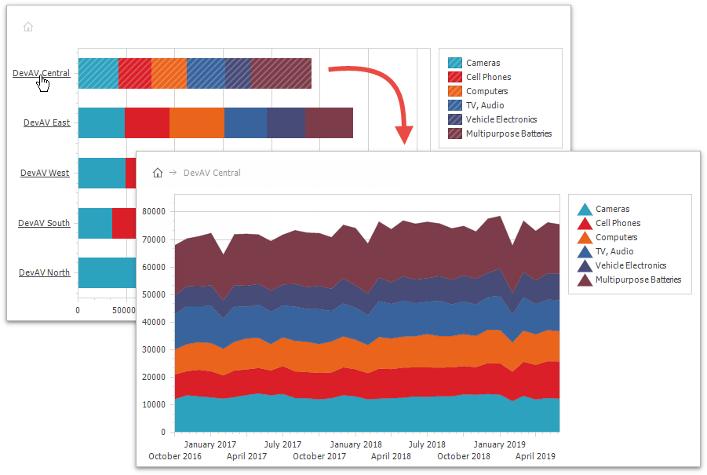

<!-- default file list -->
*Files to look at*:

* [Form1.cs](./CS/Form1.cs) (VB: [Form1.vb](./VB/Form1.vb))
<!-- default file list end -->
# How to: Create a Drill-Down Chart

This example demonstrates how to demonstrate master-detail data in the same chart.

You can only use the Drill-Down functionality when [chart series](https://docs.devexpress.com/WindowsForms/6167/controls-and-libraries/chart-control/fundamentals/chart-elements/series) are generated by [series templates](https://docs.devexpress.com/WindowsForms/6562/controls-and-libraries/chart-control/data-processing/data-providing/generate-series-from-a-data-source).

* Use [SeriesTemplate.ArgumentDrillTemplate](https://docs.devexpress.com/CoreLibraries/DevExpress.XtraCharts.SeriesTemplate.ArgumentDrillTemplate) to specify detail data when a user clicks an argument's [axis label](https://docs.devexpress.com/WindowsForms/5804/controls-and-libraries/chart-control/fundamentals/chart-elements/diagram/axes/axis-labels).

* Use [SeriesTemplate.SeriesDrillTemplate](https://docs.devexpress.com/CoreLibraries/DevExpress.XtraCharts.SeriesTemplate.SeriesDrillTemplate) to specify how the Chart Control displays detail data when a user clicks a [series](https://docs.devexpress.com/WindowsForms/6167/controls-and-libraries/chart-control/fundamentals/chart-elements/series) (or the series's marker in a [legend](https://docs.devexpress.com/WindowsForms/5794/controls-and-libraries/chart-control/fundamentals/chart-elements/legends)). 

* Use [SeriesTemplate.SeriesPointDrillTemplate](https://docs.devexpress.com/CoreLibraries/DevExpress.XtraCharts.SeriesTemplate.SeriesPointDrillTemplate) to specify detail data when a user clicks a [series point](https://docs.devexpress.com/WindowsForms/6168/controls-and-libraries/chart-control/fundamentals/chart-elements/series/series-points).

Refer to the [Drill Down](https://docs.devexpress.com/WindowsForms/120658/controls-and-libraries/chart-control/data-processing/data-providing/drill-down) article for more information.