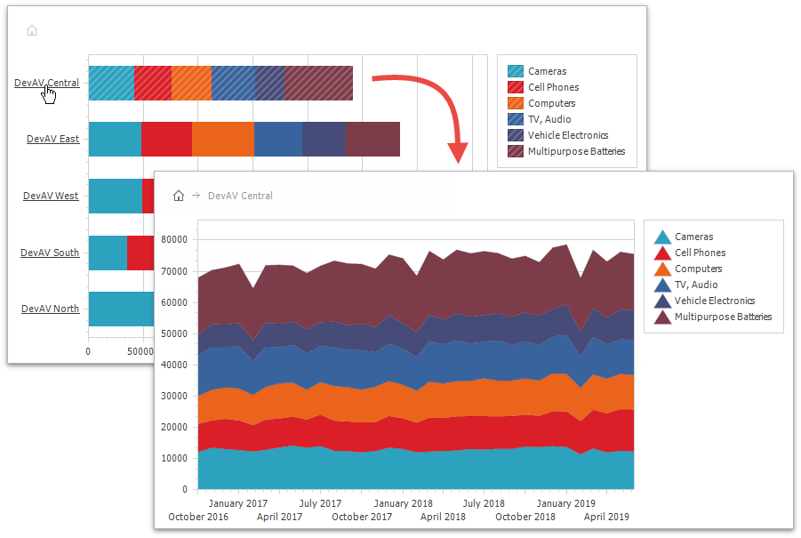

<!-- default badges list -->

[](https://supportcenter.devexpress.com/ticket/details/E1465)
[](https://docs.devexpress.com/GeneralInformation/403183)
[](#does-this-example-address-your-development-requirementsobjectives)
<!-- default badges end -->

# WinForms Chart Drill-Down

This example enables the drill-down feature, which allows users to interactively explore chart data by clicking chart elements (such as axis labels, series, or data points). The drill-down functionality is available only when [chart series](https://docs.devexpress.com/WindowsForms/6167/controls-and-libraries/chart-control/fundamentals/chart-elements/series) are generated by series templates.



## Implementation Details

### Configure Drill-Down by Argument Axis Labels

The [ArgumentDrillTemplate](https://docs.devexpress.com/CoreLibraries/DevExpress.XtraCharts.SeriesTemplate.ArgumentDrillTemplate) property specifies how to display detail data when a user clicks an argument's [axis label](https://docs.devexpress.com/WindowsForms/5804/controls-and-libraries/chart-control/fundamentals/chart-elements/diagram/axes/axis-labels).

```csharp
// Configure drill-down by argument axis labels (for example, Company → OrderDate).
SeriesTemplate argumentDrillTemplate = new SeriesTemplate();
argumentDrillTemplate.SeriesDataMember = "Category";
argumentDrillTemplate.ArgumentDataMember = "OrderDate";
argumentDrillTemplate.View = new StackedAreaSeriesView();
argumentDrillTemplate.DateTimeSummaryOptions.MeasureUnit = DateTimeMeasureUnit.Month;
argumentDrillTemplate.DateTimeSummaryOptions.SummaryFunction = "SUM([Income])";
chartControl.SeriesTemplate.ArgumentDrillTemplate = argumentDrillTemplate;
```

### Configure Drill-Down by Series or Legend Item

The [SeriesDrillTemplate](https://docs.devexpress.com/CoreLibraries/DevExpress.XtraCharts.SeriesTemplate.SeriesDrillTemplate) property specifies how to display detail when a user clicks a series or its marker in the [legend](https://docs.devexpress.com/WindowsForms/5794/controls-and-libraries/chart-control/fundamentals/chart-elements/legends).

```csharp
// Configure drill-down by series or legend item (e.g., Category → Product).
SeriesTemplate seriesDrillTemplate = new SeriesTemplate();
seriesDrillTemplate.SeriesDataMember = "Product";
seriesDrillTemplate.ArgumentDataMember = "Company";
seriesDrillTemplate.View = new StackedBarSeriesView();
seriesDrillTemplate.QualitativeSummaryOptions.SummaryFunction = "SUM([Income])";
chartControl.SeriesTemplate.SeriesDrillTemplate = seriesDrillTemplate;
```

### Configure Drill-Down by Series Point

The [SeriesPointDrillTemplate](https://docs.devexpress.com/CoreLibraries/DevExpress.XtraCharts.SeriesTemplate.SeriesPointDrillTemplate) property specifies how to display detail when a user clicks a [series point](https://docs.devexpress.com/WindowsForms/6168/controls-and-libraries/chart-control/fundamentals/chart-elements/series/series-points) in the chart.

```csharp
// Configure drill-down by series point (e.g., Category-Company → Product by Month).
SeriesTemplate seriesPointDrillTemplate = new SeriesTemplate();
seriesPointDrillTemplate.SeriesDataMember = "Product";
seriesPointDrillTemplate.ArgumentDataMember = "OrderDate";
seriesPointDrillTemplate.View = new StackedAreaSeriesView();
seriesPointDrillTemplate.DateTimeSummaryOptions.MeasureUnit = DateTimeMeasureUnit.Month;
seriesPointDrillTemplate.DateTimeSummaryOptions.SummaryFunction = "SUM([Income])";
chartControl.SeriesTemplate.SeriesPointDrillTemplate = seriesPointDrillTemplate;
```

## Files to Review
* [Form1.cs](./CS/Form1.cs) (VB: [Form1.vb](./VB/Form1.vb))

## Documentation

[Drill-Down, WinForms Chart Control](https://docs.devexpress.com/WindowsForms/120658/controls-and-libraries/chart-control/data-processing/data-providing/drill-down)

<!-- feedback -->
## Does this example address your development requirements/objectives?

[](https://www.devexpress.com/support/examples/survey.xml?utm_source=github&utm_campaign=how-to-create-a-drill-down-chart-e1465&~~~was_helpful=yes) [](https://www.devexpress.com/support/examples/survey.xml?utm_source=github&utm_campaign=how-to-create-a-drill-down-chart-e1465&~~~was_helpful=no)

(you will be redirected to DevExpress.com to submit your response)
<!-- feedback end -->
